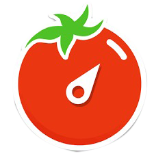

# Focus Time


>This project was a FocusTime created while doing the React Native course.
---
**Technologies used:** 

* React Native

---
**Configuration:**

After cloning the respository, install the dependencies:

```
yarn install
```
or
```
npm install
```

After installing the dependencies:

```
yarn start
```
or
```
npm start
```

You can also run:

```
npm run ios
```
or
```
yarn run ios
```
Like ```npm start```, but also attempts to open your app in the iOS Simulator if you're on a Mac and have it installed.

or in case for an android
```
npm run android
```
or 
```
yarn run android
```
